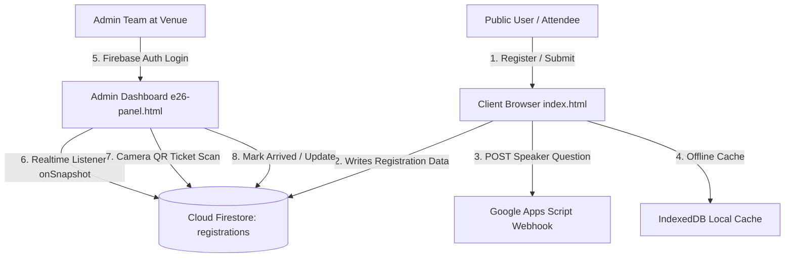

# Backend & Security Audit Report — Flagship '26

**Date:** 27 August 2026  
**Target Application:** Flagship '26 (E-Cell VNIT Nagpur)  
**Scope:** Firebase Architecture, Firestore Security Rules, Authentication, Data Flows, Admin Panel (`e26-panel.html`), and Third-Party Integrations.

---

## Executive Summary

| Category | Rating | Status |
| :--- | :---: | :--- |
| **System Architecture** | **8.5 / 10** | Robust, lightweight serverless architecture with offline IndexedDB persistence. |
| **Security & Privacy** | **5.5 / 10** | ⚠️ **Critical data leak risk** due to open Firestore read permissions on registrations. |
| **Data Integrity & Validation** | **7.5 / 10** | Good client & rule-level schema checks, minor field discrepancies. |
| **Admin Operations & Scalability** | **9.0 / 10** | Excellent live snapshot listener, camera QR scanner, and CSV export. |

---

## 1. System Architecture & Components



### Core Services
1. **Database & Storage:** Google Cloud Firestore (v12.18.0 modular SDK)
2. **Authentication:** Firebase Email/Password Auth (`getAuth`) for organizers and desk volunteers.
3. **Local Persistence:** `persistentLocalCache()` enabled on client and admin for zero-downtime offline operation during auditorium connectivity drops.
4. **Speaker Q&A Engine:** Google Apps Script REST Endpoint (`script.google.com`).
5. **Ticket & QR Generation:** Client-side HTML5 Canvas + `qrcodejs` with cryptographically distinct ticket IDs (`F26-XXXXXXXX`).

---

## 2. Security Vulnerabilities & Findings

### 🔴 CRITICAL 1: Public Read Access on Entire Registration Database
* **Location:** `firestore.rules` (Line 23)
  ```javascript
  // firestore.rules
  match /registrations/{docId} {
    allow read: if true; // ⚠️ CRITICAL VULNERABILITY
  }
  ```
* **Vulnerability:** Anyone with the public `apiKey` and `projectId` (visible in client source) can query and dump the **entire attendees database**, including:
  * Full Names
  * Personal Email Addresses
  * Phone Numbers
  * Colleges / Institutions
  * Ticket IDs & Check-in statuses
* **Why it was introduced:** The client registration script runs a duplicate check query:
  `query(collection(db, 'registrations'), where('email', '==', email))` before creating a ticket.
* **Remediation Options:**
  1. **Strict Admin Rule (Recommended):**
     `allow read: if request.auth != null;`
  2. **Single Document Lookup Rule:** If public duplicate lookup is required, enforce that queries must filter by a single specific email rather than allowing unbounded collection scans.

---

### 🟡 HIGH 2: Missing Firestore Security Rule for Question Submissions
* **Location:** `firestore.rules` (Default deny on line 30)
* **Vulnerability:** The rules end with `match /{document=**} { allow read, write: if false; }`. While questions currently route through Google Apps Script, if the team switches or adds Firestore fallback for questions (e.g. `collection(db, 'questions')`), writes will fail immediately with `permission-denied`.
* **Remediation:** Explicitly declare rule permissions if questions are ever stored in Firestore:
  ```javascript
  match /speaker_questions/{docId} {
    allow create: if request.resource.data.name is string 
                 && request.resource.data.question is string 
                 && request.resource.data.question.size() <= 300;
    allow read, update, delete: if request.auth != null;
  }
  ```

---

### 🟡 MEDIUM 3: Field Validation Discrepancies
* **Location:** `firestore.rules` vs `index.html`
* **Finding:** `firestore.rules` checks `hasAll(['name', 'email', 'college', 'role', 'ticketId', 'arrived'])`, but `index.html` also writes:
  * `phone` (string)
  * `arrivedAt` (`null` or `timestamp`)
  * `event` (`"Flagship '26"`)
  * `registeredAt` (`serverTimestamp()`)
* **Risk:** The fields are currently allowed because `hasAll` does not forbid extra fields, but `phone` length and formatting are not validated by backend rules, leaving it vulnerable to malicious oversized payloads.

---

### 🟢 LOW 4: Ticket ID Generation Collision Risk
* **Location:** `index.html` (`genTicketId()`)
* **Finding:** Ticket IDs are generated on the client via `Math.random()` with 8 alphanumeric characters (`32^8 ≈ 1.09 × 10^12` combinations).
* **Assessment:** Given an event scale of 500–2,000 attendees, the collision probability is negligible (`~1 in 10^6`), but using `crypto.getRandomValues()` is best practice.

---

## 3. Performance & Operational Strengths

1. **Zero-Lag Event Day Operations:**
   * The `e26-panel.html` dashboard utilizes `onSnapshot()` WebSocket listeners, so attendee arrival numbers and statistics update instantly across all volunteer scanning phones in real time.
2. **Built-in QR Camera Scanner:**
   * Integrated HTML5 video stream scanner with automatic debounce (3-second anti-double-scan buffer), instant visual feedback (Success / Warning / Error), and ticket verification.
3. **Data Portability:**
   * One-click CSV export with sanitization (`exportCSV()`) ensuring organizers can backup registration lists to Excel / Google Sheets at any time.

---

## 4. Recommended Hardened `firestore.rules`

Here is the recommended production-grade `firestore.rules`:

```javascript
rules_version = '2';
service cloud.firestore {
  match /databases/{database}/documents {

    // ── Registrations Collection ──
    match /registrations/{docId} {
      
      // Public can register (with strict validation)
      allow create: if
        request.resource.data.keys().hasAll(['name', 'email', 'college', 'role', 'ticketId', 'arrived'])
        && request.resource.data.name is string
        && request.resource.data.name.size() > 0
        && request.resource.data.name.size() <= 100
        && request.resource.data.email is string
        && request.resource.data.email.matches('^[^\\s@]+@[^\\s@]+\\.[^\\s@]+$')
        && request.resource.data.college is string
        && request.resource.data.college.size() <= 150
        && request.resource.data.role in ['student', 'professional', 'founder']
        && request.resource.data.ticketId is string
        && request.resource.data.ticketId.size() <= 20
        && request.resource.data.arrived == false;

      // Only logged-in admin desk volunteers can view attendee lists
      allow read: if request.auth != null;

      // Only authenticated admins can check-in attendees or delete records
      allow update, delete: if request.auth != null;
    }

    // ── Speaker Questions (Optional Firestore route) ──
    match /speaker_questions/{docId} {
      allow create: if request.resource.data.name is string
                   && request.resource.data.question is string
                   && request.resource.data.question.size() <= 400;
      allow read, update, delete: if request.auth != null;
    }

    // Default deny all other collections
    match /{document=**} {
      allow read, write: if false;
    }
  }
}
```

---

## 5. Deployment Instructions

To deploy the hardened backend rules to Firebase:
```powershell
firebase deploy --only firestore:rules
```
